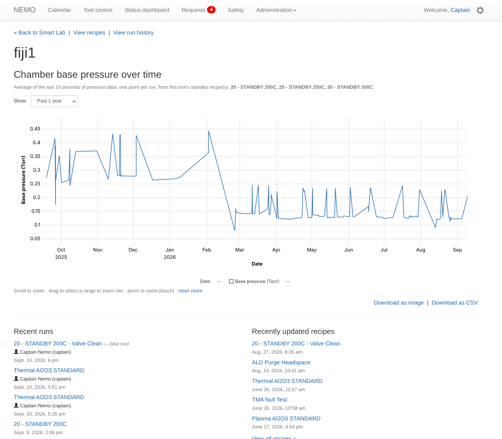
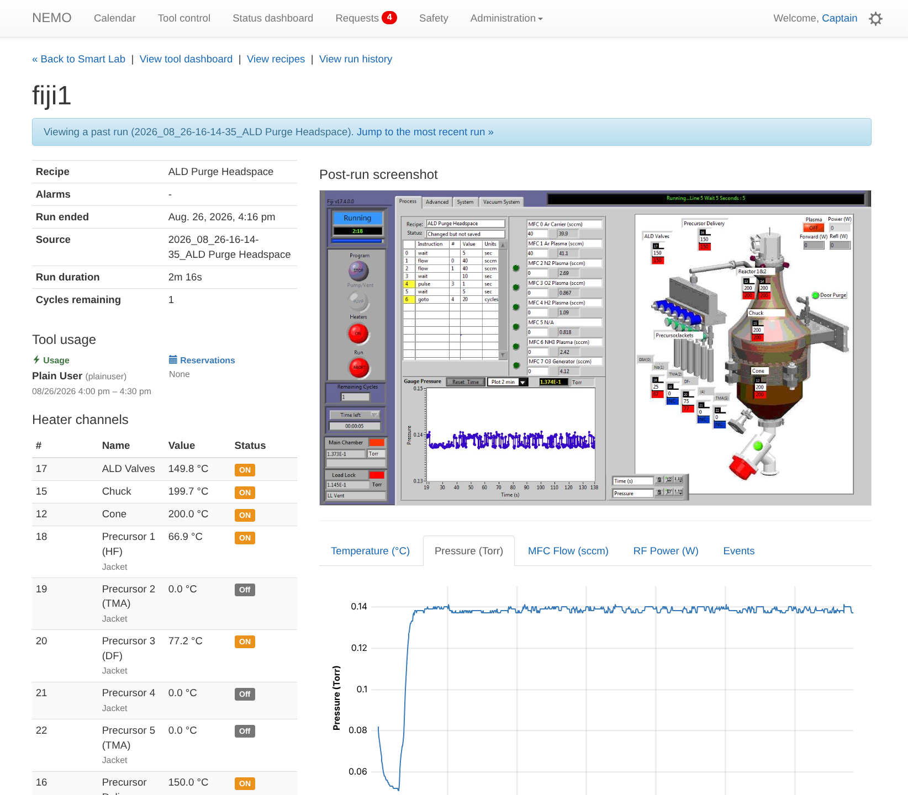
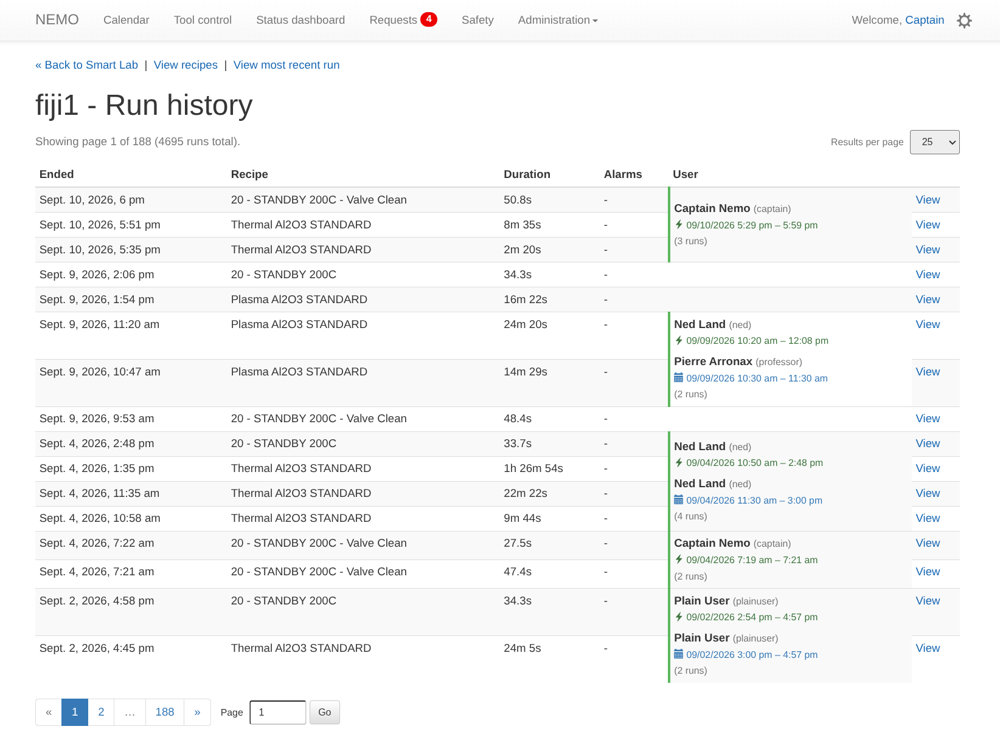
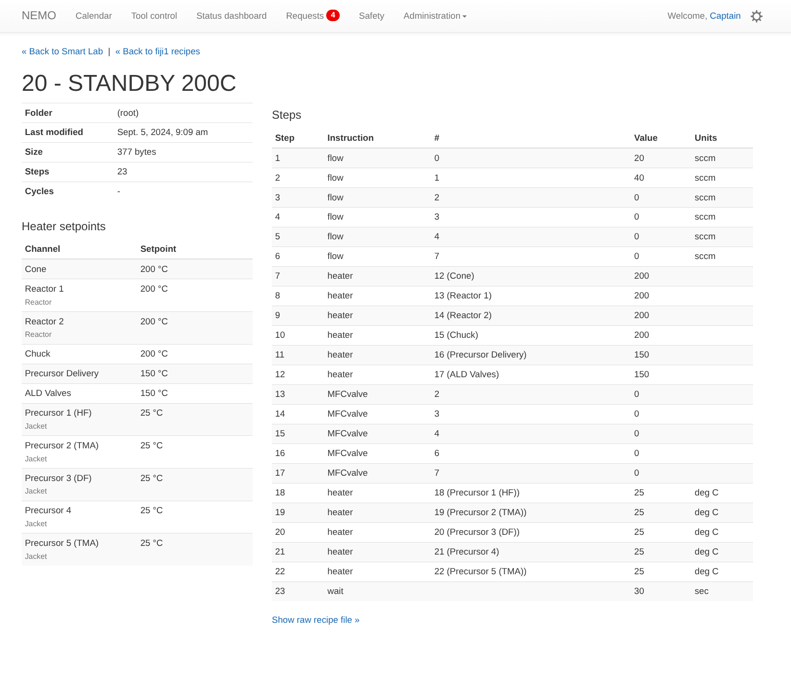
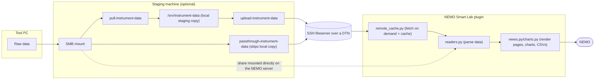

# NEMO Smart Lab

[](https://github.com/psf/black)
[](https://github.com/SNF-Root/NEMO-Smart-Lab/blob/main/LICENSE)

> [!IMPORTANT]
> This project is an active work in project, and many features listed are not fully functional or reliable. Please refrain from production use for now.

Plugin for [NEMO](https://github.com/usnistgov/NEMO) to process and display instrument data (telemetry data, past run logs, recipes, etc.) collected from tools connected to NEMO, allowing staff to reliably diagnose problems and monitor the health of tools outside of the cleanroom.

This is part of a broader project built at [Stanford University's nanolabs](https://nanolabs.stanford.edu/) to network cleanroom tools through our [Secure Research Lab Network](https://uit.stanford.edu/service/secure-research-lab-network) and make the data available on our High-Performance Computing storage solution, [Oak](https://uit.stanford.edu/service/oak-storage), which this plugin (and a separate staging machine) uploads and accesses the collected data through a SSH-based Data Transfer Node. However, this system has been designed to be modular and easily extensible, allowing a wide range of deployment across different universities and other environments regardless of their IT configuration.

This repository houses the code for the NEMO plugin, as well as the shell scripts the staging machine runs. Actual processing of data is currently performed in the plugin and is aggressively cached. In the future, non-flatfile data may be processed by the staging machine and cached prior to upload.

## Preview









## Features

- Automated collection of data over mapped and mounted SMB network drives before uploading the data over a DTN
- Improves management and monitoring of instruments by making telemetry information remotely available
- Access and modify recipes from NEMO, with the ability to restrict visibility or make standardized recipes broadly available
- Historical analysis of tool data over time using a combination of telemetry and run log information to allow monitoring of various gauges (chamber base pressure, etc.)
- Processing of PTIQ (Oxford Instruments) telemetry data, Veeco Fiji/Savannah data as well as other streamed data formats
- Reads from the raw process logs to display other useful diagnostic information (faults/alarms during run, per-heater channel status, planned v. actual step time data, etc.) rendering charts and graphs in a desktop and mobile-friendly UI
- Browser rendered interactive dataviz with [μPlot](https://github.com/leeoniya/uplot) and downloadable [matplotlib](https://matplotlib.org/) charts as well as CSVs for use as reference in documents, presentations, etc.
- Wide range of customization through Django admin: per-channel display names/roles/thresholds, keyword-based dashboard status detection, base pressure recipe tracking, pinned recipe folders, and more
- Lots of tests and debugging utilities, allowing a remote pass through layer before actual production use
- Aggressive, multi-layer caching throughout (remote listings, fetched files, parsed file contents, resolved tool config) tuned from real production timing - see [Performance & caching](#performance--caching) below

## Support

| Type         | Tool examples                                 | Reads                                                                                                                                      |
| ------------ | --------------------------------------------- | ------------------------------------------------------------------------------------------------------------------------------------------ |
| `heater_log` | Veeco Fiji / Savannah ALD                     | `<root>/Logfile/Heater Data/*.txt` (one file per run), plus sibling `Logfile/Pressure Data/*.txt` and `Logfile/RF Data/*.txt` when present |
| `mvd`        | Cambridge Nanotech MVD, Veeco Fiji 5          | `<root>/log/data/<timestamp>_<recipe>/*_SUM.txt` + `*_DAT.txt` (+ `*_PT.txt` pressure, `*_EVT.txt` events, when present)                   |
| `waferlog`   | Plasma-Therm VersaLine (e.g. hdpcvd)          | `<root>/WaferLog-Data/*.txt` (one file per wafer run)                                                                                      |
| `cobra_job`  | Oxford Instruments PlasmaPro 100 Cobra (PTIQ) | `<root>/Databases-Data/Jobs.db` (SQLite, read-only), optionally live `PTIQ/Databases/StreamedData` telemetry                               |
| `eventlog`   | KLA-DSE (Trikon/SPTS "fxPLPXTMC")             | `<root>/EventLog-Data/CurrentEvents.csv`                                                                                                   |

## Architecture

Everything lives under `NEMO_smart_lab/`, a standard Django app (label `smart_lab`) meant to be dropped into an existing NEMO installation's `INSTALLED_APPS`. It never touches NEMO's own database tables except to _read_ `Tool`/`UsageEvent`/`Reservation` - all of this plugin's own configuration and state lives in its own tables (see `models.py`), so it can be added to or removed from a NEMO deployment without touching NEMO's schema.



## Installation

```bash
pip install "NEMO-smart-lab[NEMO]"   # or NEMO-smart-lab[NEMO-CE] for NEMO Community Edition
```

in `settings.py` add to `INSTALLED_APPS`:

```python
INSTALLED_APPS = [
    '...',
    'NEMO_smart_lab',
    '...'
]
```

Run `python manage.py migrate` to create this plugin's tables, then configure your tools from
the Django admin under **Smart Lab > Smart Lab tools**. There is one row per Tool, matching the exact
`Tool.name` NEMO already uses for it.

Then visit `/smart_lab/`, or the new "Smart Lab" tile on the landing page.

### Configuring a tool

The important fields on a `SmartLabTool` row, grouped the same way the admin form groups them:

- **Basics**: `name` (must exactly match a real `Tool.name`), `kind` (see the Support table above), `local_root` (where its raw data lives on disk), `enabled` (unchecking hides it from the dashboard entirely).
- **Thresholds**: `on_threshold_c` / `on_threshold_pct` - the default "is this channel actually on" cutoff, overridable per channel (below).
- **Overview status (dashboard)**: `standby_recipe_keywords` / `shutdown_recipe_keywords` / `valve_clean_recipe_keywords` - comma-separated, case-insensitive keywords matched against the latest run's recipe name to decide the dashboard's status badge when the tool isn't actively in use right now (checked live - this recipe-name matching is only a fallback for when no one's currently logged in).
- **Chamber base pressure history**: `base_pressure_recipe_names` - a comma-separated list of _exact_ recipe names whose runs feed the base-pressure-over-time chart on the tool's dashboard page. Use the **"Auto-detect standby recipes for base pressure tracking"** admin action (select the tool's row in the list, pick the action from the dropdown) instead of typing these by hand - it scans recipes matching `standby_recipe_keywords` whose last step is a `wait` (the real signal a recipe ends in a settle-then-measure period), excluding anything also matching `valve_clean_recipe_keywords` (a valve-clean variant of an otherwise-normal standby recipe can have a very different baseline pressure).
- **Live telemetry** (`cobra_job` only): `stream_root` / `stream_module` - adds a "Telemetry" section reading raw PTIQ `StreamedData` (needs the `msgpack` package).
- **Remote sync**: `sync_endpoint` / `remote_subdir` (see below), `recipe_subdir` (folder to browse recipes from), `recipe_channel_offset` (heater-log-kind tools only - see its own help text; translates a recipe's physical channel numbers to the log file's own channel numbering when they differ), `pinned_recipe_categories` (which recipe folders show first).
- **Reservation lookup**: `usage_reference_source` - an optional other NEMO instance's API to fall back to (read-only) when this tool has no local `Reservation`/`UsageEvent` history for a run.
- **Demo/dev seeding**: `real_id` / `real_category` - only used by `seed_smart_lab_demo`.
- **Channel labels** (inline on the tool, or Smart Lab > Channel labels): one `SmartLabToolChannel` row per physical channel you want to give a real name/role/threshold override to instead of showing its raw log key (e.g. `"Heater 3"` -> display name `"Source chuck"`, role `chuck`). A channel's role is shown as a small subtitle under its name (on both the run detail page's channel table and a recipe's own heater-setpoints table) - but only when another channel shares that role, so it doesn't just repeat what the name already says. Nothing populates these automatically; fill them in once, by hand, per tool.

### Optional: pull tool data down from a remote SSH fileserver

If a tool's raw data lives on a remote host reachable over SSH, rather
than a network share you can mount directly, data can be pulled down **on demand** (see
[Performance & caching](#performance--caching)) or eagerly mirrored ahead of time with
`sync_remote_data`.

First add a **Remote sync endpoint** in the admin (Smart Lab > Remote sync endpoints) describing
the remote host:

| Field               | Example (Oak)              |
| ------------------- | -------------------------- |
| `name`              | `Oak`                      |
| `host`              | `dtn.oak.stanford.edu`     |
| `username`          | account name               |
| `ssh_key_path`      | `/etc/nemo/oak_id_ed25519` |
| `base_path`         | `/oak/stanford/orgs/nano`  |
| `extra_ssh_options` | optional                   |

Then, on each `SmartLabTool` that should sync from it, set **Remote sync > sync_endpoint** to
that endpoint, and optionally **remote_subdir** if the directory name on the remote host doesn't
match the tool's own name exactly (e.g. the tool lives at
`/oak/stanford/orgs/nano/fiji-1-data` but is configured here as `"fiji1"`).

Once `sync_endpoint` is set, every read (`readers.py`, `recipes.py`) fetches only what it actually
needs, when it needs it, straight into `local_root` - there's no requirement to run
`sync_remote_data` at all. It remains useful for eagerly warming the cache on a schedule (cron/Task
Scheduler) so the _first_ page load after a deploy/restart isn't the one paying to fetch anything:

```bash
python manage.py sync_remote_data              # sync every tool with a sync_endpoint set
python manage.py sync_remote_data fiji1        # just one
python manage.py sync_remote_data --dry-run    # rsync -n, if rsync is installed
```

### Optional: seed a demo/dev database

```bash
python manage.py seed_smart_lab_demo
```

Creates/renames a `Tool` for every `SmartLabTool` row (at its `real_id`, if set) and the
"Smart Lab" landing page tile. By default it also deletes every _other_ `Tool` (and whatever
cascades from it - reservations, usage events, etc.) so a demo database seeded from NEMO's
splash-pad fixture ends up with just the Smart Lab tools; pass `--keep-other-tools` to skip that.

## Usage

- **`/smart_lab/`** - dashboard of every configured tool, grouped by category, with a live status badge (e.g. "ON" for an active heater, "N fault(s)" for a KLA-DSE run with alarms, a Cobra job's own `Status`, or a keyword-matched "Standby"/"Shutdown"/"Ready"). Each tool card has separate **Dashboard**, **View last run**, **Recipes**, and **History** buttons.
- **`/smart_lab/tool/<slug>/`** - for `heater_log`/`mvd`-kind tools, this is the tool's own **dashboard/overview page**: chamber base pressure over time (if `base_pressure_recipe_names` is configured - a time-range picker defaulting to "Past 1 year", download as PNG/CSV, and clicking a point jumps straight to the run that produced it), the 5 most recent runs (who ran them, when, with a "(last run)" tag on the newest), the 5 most recently-edited recipes, and any recent faulty/aborted runs. For every other kind (no linear per-run history), this _is_ the most recent run's own detail page.
- **`/smart_lab/tool/<slug>/?run=<run_id>`** - a specific past run's full detail page: recipe, timing, per-channel table, tool usage (who reserved/ran it), and a tabbed set of interactive charts appropriate to the tool (temperature, pressure - shown right after temperature -, flow, power, etc. for heater/mvd-kind tools; a Gantt-style step timeline for Cobra jobs; an event scatter timeline for KLA-DSE). Get `run_id` values from the history page below, or from the dashboard page's "Recent runs"/"Recent faulty runs" panels, which already link there.
- **`/smart_lab/tool/<slug>/history/`** - paginated list of past runs (with a jump-to-page-number box); only the runs on the requested page are actually parsed, so this stays fast regardless of how many runs a tool has on disk (tens of thousands, for a long-lived SQLite-backed tool). Landing here from a specific run's detail page jumps straight to the page that run is actually on.
- **`/smart_lab/tool/<slug>/recipes/`** - read-only recipe browser, grouped by folder (pin a folder to the top with the pushpin icon), sortable by clicking the Name/Last modified/Size column headers.
- **`/smart_lab/tool/<slug>/recipes/<recipe_id>/`** - one recipe's full step table, including a heater-setpoints summary (with the same name/role-subtitle treatment as the run detail page's channel table) and the raw recipe text.

## Performance & caching

Given a data flow of _remote fileserver -> local disk -> parsed in Python_, most real slowness this
project has hit in practice came from one of two places, both addressed directly rather than
worked around:

- **Redundant network round trips.** `remote_cache.py` never assumes `local_root` is a fully
  eager mirror - every read is "fetch on demand, then trust what's on disk." A file that already
  exists locally is trusted outright and never re-verified over the network, regardless of
  whatever in-memory freshness cache state exists at the time (a process restart used to force a
  full re-verification of every already-fetched file).
- **Redundant parsing.** Every file parse is memoized by content fingerprint (mtime+size), so
  re-visiting the same run/recipe/chart is effectively free after the first time, however many
  requests it's split across. Where the parse itself was measurably slow even once (mvd's
  `_DAT.txt` format - some real files run past 200,000 rows), it's accelerated with a
  `numpy`-based fast path (a real ~7x speedup, measured against actual data) with an
  always-correct pure-Python fallback for anything it can't handle cleanly.

Both the remote-freshness cache and the parsed-file cache use Django's cache framework, defaulting
to the process-local `LocMemCache` - fine for a single-process deployment. A deployment that wants
either cache to survive a restart (or be shared across multiple worker processes) can opt in by
adding a cache aliased `"smart_lab"` to `settings.CACHES`, e.g.:

```python
CACHES = {
    "default": {...},
    "smart_lab": {
        "BACKEND": "django.core.cache.backends.filebased.FileBasedCache",
        "LOCATION": "/path/to/some/writable/dir",
    },
}
```

No `"smart_lab"` alias configured (the default) means both caches fall back to the project's
plain default cache, exactly as if this option didn't exist.

## Tests

To run the tests:

```bash
python run_tests.py
```

Tests are self-contained (each test generates its own small synthetic log files/database in a
temp directory, or mocks the actual network calls in `remote_sync.py`) and don't depend on any
real tool data or network access being present.

## License

This project was built at the Stanford Nanofabrication Facility, and has been released under the GNU Affero General Public License v3.0. Please see [LICENSE.md](LICENSE.md) for more details.
