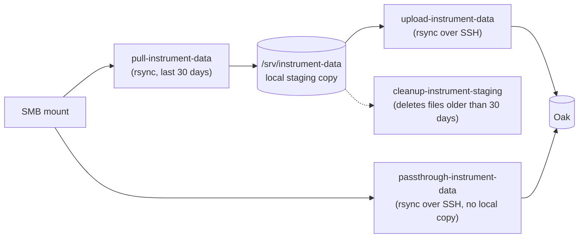

# Instrument data staging

Shell scripts (and the systemd units that schedule them) for a small always-on machine ("Think-Lab"
in the unit descriptions below, but the name is arbitrary) that sits between the cleanroom tool PCs
and Oak (or any other SSH-reachable fileserver the plugin is connected to). It exists because tool PCs
generally can't SSH out to Oak themselves, but *can* be mounted as an SMB share on a machine that can.
The goal is to minimize actual processing on the instruments themselves as much as possible by exposing
directories over the network this way.

None of this is required to use the plugin, as a tool's `local_root` can just as well be a network
share mounted directly on the machine running NEMO, in which case none of this directory applies.



- **Pull + upload** (`instrument-pull` then `instrument-upload`) - keeps a local copy of the last
  month of each tool's data on the staging machine's own disk before pushing it on to Oak. Slower
  and uses local disk, but gives you a second, independent local copy of recent data and lets the
  two steps run on independent schedules/retry independently.
- **Passthrough** (`instrument-passthrough`) - rsyncs straight from each tool's SMB mount to Oak
  over SSH; nothing is ever written to the staging machine's own disk. Simpler and needs no local
  storage, but there's no local fallback copy if a single run fails partway.

Run one or the other, not both against the same tools at the same time -
`passthrough-instrument-data` refuses to start while `instrument-pull.service` or
`instrument-upload.service` is active, as a safety check, but the timers themselves don't enforce
that for you - only enable the set of `.timer` units that matches the mode you actually want.

## The scripts

All four scripts live in `scripts/` and are meant to be installed to `/usr/local/sbin/` (matching
the paths the `.service` units below use). Each defaults to a safe, non-destructive **preview**
mode and only does the real thing with an explicit flag - useful for testing a new deployment
before trusting it on a timer.

- **`pull-instrument-data`** - for each tool (fetched from NEMO - see [Where the tool
  list comes from](#where-the-tool-list-comes-from) below), rsyncs files modified in the last
  month from `/mnt/<name>` into `/srv/instrument-data/<name>`. Refuses to run if the system clock
  looks wrong (before a hardcoded sanity-check date) or if the staging filesystem has less than
  2 GiB free, rather than silently doing something wrong or filling the disk. No flag needed - it's
  additive/non-destructive by nature (`rsync`, never deletes).
- **`upload-instrument-data [--upload]`** - rsyncs each tool's staged local copy
  (`/srv/instrument-data/<name>/`) up to Oak over SSH, into a per-tool remote directory (`Fiji1`,
  `Fiji2`, `MVD`, etc. - the exact `remote_subdir` values the plugin's own `SmartLabTool` rows are
  configured with, fetched from NEMO the same way). No flag (or any other argument) runs a dry run
  (`rsync --dry-run`) and prints what *would* transfer; `--upload` actually does it. Takes an
  exclusive lock (`~/.instrument-upload.lock`) so a slow run doesn't overlap with itself if the
  timer fires again before it finishes.
- **`passthrough-instrument-data [--upload]`** - the alternative to pull+upload above: rsyncs
  straight from each tool's `/mnt/<name>` mount to Oak over SSH, skipping local disk entirely. Same
  preview/`--upload` convention and its own lock file; additionally refuses to start while
  `instrument-pull.service` or `instrument-upload.service` is currently running.
- **`cleanup-instrument-staging [--delete]`** - deletes (or, without `--delete`, just reports)
  files older than 30 days (by creation time, `stat`'s `%W`) under `/srv/instrument-data`, so the
  pull+upload path's local staging copy doesn't grow forever. Refuses to run with `--delete` while
  `instrument-pull.service` is active. Only used by the pull+upload path - passthrough never
  writes anything locally for this to clean up, and doesn't need the tool list at all (it just
  walks whatever's already on disk).

Every script (other than `cleanup-instrument-staging`, which needs none of this) also requires its
own **placeholder values to be filled in before use**, at the top of the file (deliberately not
committed with real values):

- `upload-instrument-data`/`passthrough-instrument-data`: `ssh_host` / `ssh_base` / `ssh_user` /
  `identity_file` - your Oak (or other) endpoint.
- All three (`pull-instrument-data` included): `nemo_sync_map_url` / `nemo_api_key` - see below.

### Where the tool list comes from

All three transfer scripts fetch their tool list - and, for upload/passthrough, each tool's Oak
directory name - at runtime from the NEMO Smart Lab plugin's own `SmartLabTool` table, via a small
read-only JSON endpoint (`views.tool_sync_map`), rather than each script hardcoding (and needing to
be kept in sync with) its own copy of that list. This is handled by the shared
`scripts/lib/nemo-tool-map.sh` helper, which every transfer script sources.

To use this, on the **NEMO side**:

1. Set `SMART_LAB_STAGING_API_KEY` in that instance's `settings.py` (or wherever it reads secrets
   from) to a long random string - the endpoint refuses every request (fails closed) until this is
   set.
2. Make sure the tools you want staged have `sync_endpoint` set on their `SmartLabTool` row (Smart
   Lab > Smart Lab tools admin) - only tools with a `sync_endpoint` configured are included in the
   mapping, since a tool with no remote sync has no Oak directory to push into anyway.

Then, in **each staging script**, set:

```bash
nemo_sync_map_url="https://your-nemo-instance.example.edu/smart_lab/api/sync-map.json"
nemo_api_key="the same long random string from step 1"
```

`jq` is required on the staging machine to parse the response (`curl` was already required).
Adding a new tool, or renaming one's Oak directory, is now just an admin-panel edit on the NEMO
side - no script changes needed on the staging machine at all.

## Installing the systemd units

The `.service`/`.timer` files in `services/` assume the scripts above are installed at
`/usr/local/sbin/<script-name>` and run as a dedicated `think-lab` user/group - adjust `User=`/
`Group=`/`Environment=HOME=...` in the `.service` files if you use a different account.

```bash
sudo cp scripts/* /usr/local/sbin/
sudo chmod +x /usr/local/sbin/{pull,upload,passthrough}-instrument-data /usr/local/sbin/cleanup-instrument-staging

sudo cp services/*.service services/*.timer /etc/systemd/system/
sudo systemctl daemon-reload

# Pull + upload path:
sudo systemctl enable --now instrument-pull.timer instrument-upload.timer

# ...or the passthrough path instead:
sudo systemctl enable --now instrument-passthrough.timer

# Either way, if you're using the pull+upload path:
sudo systemctl enable --now instrument-cleanup.timer
```

Default schedule (all times local to the staging machine): pull and passthrough both run at 8 AM
and 8 PM, upload at 8:30 AM and 8:30 PM (half an hour after pull, so it's uploading a settled
snapshot rather than racing an in-progress pull), and cleanup once daily at 2 AM. Edit the
`OnCalendar=` lines in the relevant `.timer` file to change this.

Check on things the normal systemd way:

```bash
systemctl status instrument-pull.timer instrument-upload.timer
journalctl -u instrument-upload.service -n 50
```

## Known limitations

- `Dockerfile` at the root of this directory is a placeholder - dockerizing this staging
  environment is still on the main [README's TODO list](../README.md#features).
- If the configured NEMO instance is unreachable when a transfer script runs (network blip, NEMO
  itself down for maintenance, etc.), that run fails outright rather than falling back to a
  previously-fetched tool list - there's no local caching of the mapping on the staging machine.
  Given these scripts already run on a schedule (twice daily), a single missed run self-heals at
  the next scheduled run.
